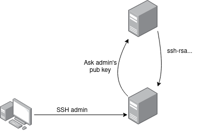

# SSHPKM



Documentation

### Managing User

Creating user
```
create user test
```

### Managing Server Access

Create host
```
create host adminVM
```

## Configure SSH

[SSH Documentation](https://man7.org/linux/man-pages/man5/sshd_config.5.html)
```
     AuthorizedKeysCommand
             Specifies a program to be used to look up the user's public
             keys.  The program must be owned by root, not writable by
             group or others and specified by an absolute path.
             Arguments to AuthorizedKeysCommand accept the tokens
             described in the TOKENS section.  If no arguments are
             specified then the username of the target user is used.

             The program should produce on standard output zero or more
             lines of authorized_keys output (see AUTHORIZED_KEYS in
             sshd(8)).  AuthorizedKeysCommand is tried after the usual
             AuthorizedKeysFile files and will not be executed if a
             matching key is found there.  By default, no
             AuthorizedKeysCommand is run.
```


Use the command `AuthorizedKeysCommand` to hook the SSH public key, it must call a script that will request the key in SSHPKM service.

`vim /etc/ssh/sshd_config`:
```
AuthorizedKeysCommand /bin/getkey
```

`vim /bin/getkey`:
```
#!/bin/bash
curl https://<ip>:<port>/ curl -H "SSH-Host: adminVM" -H "SSH-User: teste"
```